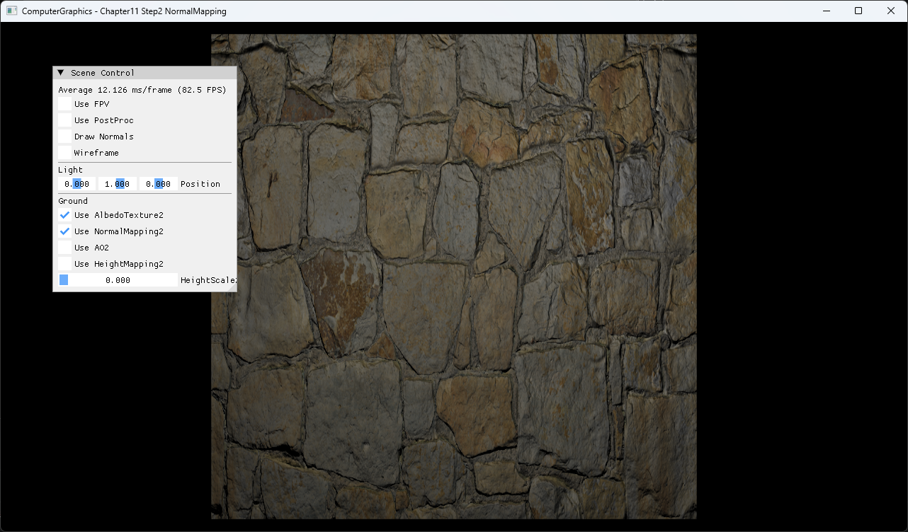

# Chapter11 Step2 NormalMapping

## Overview

Tangent-space normal texture를 TBN basis로 world space에 변환해 geometry를 늘리지 않고 표면의 조명 방향 변화를 만든다.

## 실행 진입점

- Solution: `11_TexturingTechniques_Step2_NormalMapping.sln`
- Application entry: `main.cpp`
- 주요 source: `ExampleApp.cpp`, `BasicMeshGroup.cpp`
- Shader: `BasicVertexShader.hlsl`, `BasicPixelShader.hlsl`

## Code Map

| 파일 | 역할 |
| --- | --- |
| [ExampleApp.cpp](ExampleApp.cpp#L61-L103) | albedo·normal·AO texture와 sphere 설정 |
| [BasicVertexShader.hlsl](BasicVertexShader.hlsl#L30-L56) | tangent·normal 기반 TBN 전달 |
| [BasicPixelShader.hlsl](BasicPixelShader.hlsl#L61-L82) | normal texture decode와 world normal 교체 |

## Capture/Result

비교 capture는 같은 camera와 material 배치에서 normal mapping만 전환한 결과를 사용한다.

- [Normal mapping Off](../../Docs/_assets/captures/part3_chapter11_02_normal_mapping_off.png): albedo 기반의 상대적으로 평평한 조명 반응
- [Normal mapping On](../../Docs/_assets/captures/part3_chapter11_02_normal_mapping_on.png): tangent-space normal이 TBN 변환을 거쳐 조명 방향에 반응하는 표면 디테일

평면 geometry를 유지하면서 석재 요철 방향에 따른 diffuse 변화가 나타난다.

## Verification

| 항목 | 결과 | 비고 |
| --- | --- | --- |
| Debug x64 build/run | 성공 | 2026-08-04 현재 확인 |
| Release x64 build/run | 성공 | project 폴더 CWD, `DirectXTK.dll` 필요 |
| Capture/Result | 완료 | 전체 창 1282×752 PNG |

## Limitations

- Normal texture의 출처와 재배포 권리는 별도 Publication 기록으로 관리한다.
- Parallax occlusion이나 silhouette 변화는 포함하지 않는다.

## Related Docs

- [Normal Mapping And Tangent Space](../../Docs/01_Topics/TexturingAndMapping/NormalMappingAndTangentSpace.md)
- [Verification](../../Docs/02_Verification/Part3_Chapter10-13/verification-index.md)
- [상세 Demo](../../Docs/03_Demos/Part3_Chapter10-13/11_02_NormalMapping.md)
- [이전 단계](../11_TexturingTechniques_Step1_Mipmaps/README.md)
- [다음 단계](../11_TexturingTechniques_Step3_HeightMapping/README.md)
