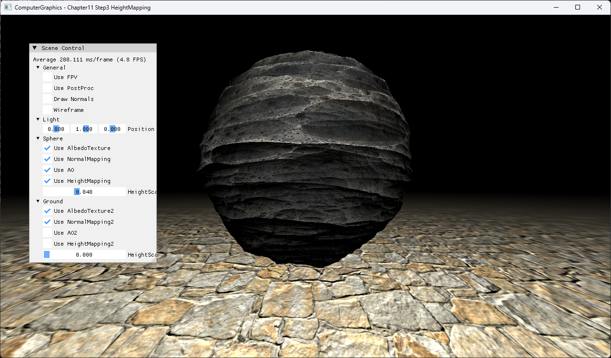

# Chapter11 Step3 HeightMapping

## Overview

Vertex shader에서 height texture를 읽고 vertex를 world normal 방향으로 이동해 실제 silhouette을 바꾸는 displacement 경로를 확인한다. Sphere의 기본 height scale은 0.04로 둔다.

## 실행 진입점

- Solution: `11_TexturingTechniques_Step3_HeightMapping.sln`
- Application entry: `main.cpp`
- 주요 source: `ExampleApp.cpp`, `BasicMeshGroup.cpp`
- Shader: `BasicVertexShader.hlsl`, `BasicPixelShader.hlsl`

## Code Map

| 파일 | 역할 |
| --- | --- |
| [ExampleApp.cpp](ExampleApp.cpp#L61-L101) | sphere height texture와 scale 설정 |
| [BasicVertexShader.hlsl](BasicVertexShader.hlsl#L40-L53) | height sample과 normal 방향 displacement |
| [ExampleApp.cpp](ExampleApp.cpp#L556-L568) | height mapping toggle과 scale UI |

## Capture/Result

Normal mapping의 조명 변화에 더해 sphere 외곽선 자체가 height texture에 따라 변한다.

## Verification

| 항목 | 결과 | 비고 |
| --- | --- | --- |
| Debug x64 build/run | 성공 | 2026-08-04 현재 확인 |
| Release x64 build/run | 성공 | project 폴더 CWD, `DirectXTK.dll` 필요 |
| Capture/Result | 완료 | 전체 창 1282×752 PNG |

## Limitations

- Vertex density가 displacement 해상도를 제한한다.
- Adaptive tessellation과 parallax occlusion은 포함하지 않는다.

## Related Docs

- [Height Mapping](../../Docs/01_Topics/TexturingAndMapping/HeightMapping.md)
- [Verification](../../Docs/02_Verification/Part3_Chapter10-13/verification-index.md)
- [상세 Demo](../../Docs/03_Demos/Part3_Chapter10-13/11_03_HeightMapping.md)
- [이전 단계](../11_TexturingTechniques_Step2_NormalMapping/README.md)
- [다음 단계](../11_TexturingTechniques_Step4_HDRI/README.md)
