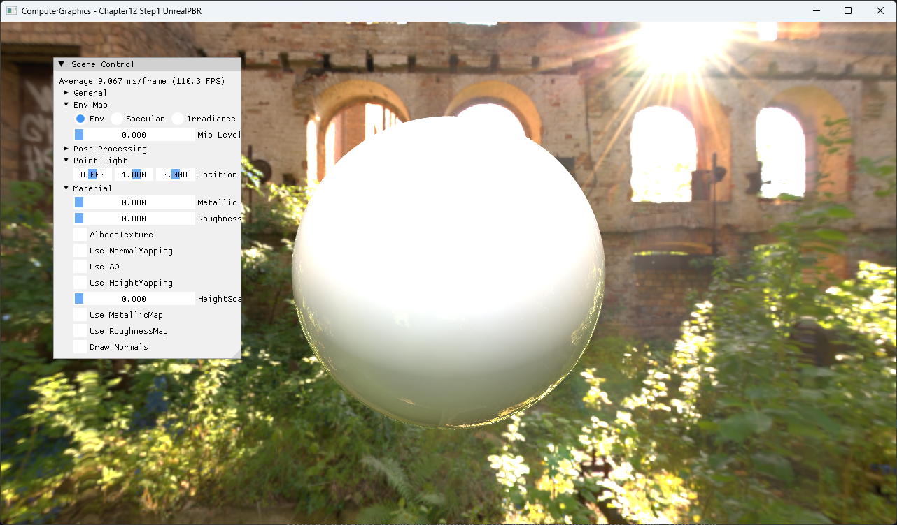
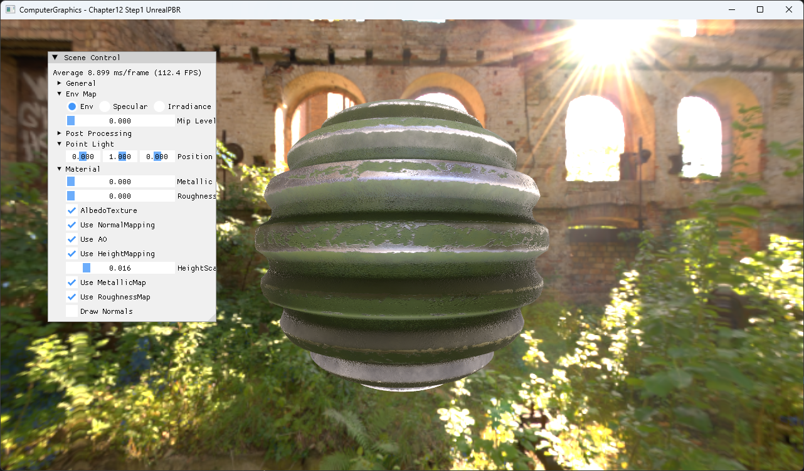

# Chapter12 Step1 UnrealPBR

Metallic-roughness material과 image-based lighting을 procedural sphere에 적용하는 예제다.

## 구현 요약

- Albedo, normal, AO, metallic과 roughness map을 하나의 material 입력으로 묶는다.
- Irradiance cube, prefiltered specular cube와 BRDF LUT로 ambient IBL을 계산한다.
- GGX NDF, Schlick Fresnel과 geometry term으로 point light의 direct BRDF를 계산한다.
- HDR scene을 resolve한 뒤 post-process를 거쳐 화면에 표시한다.

## Step11 대비 변화

Chapter11에서 분리해 확인한 texture, normal, HDR과 bloom 경로를 하나의 PBR material pipeline으로 결합한다.

## 핵심 코드

- [PBR texture와 IBL resource 구성](ExampleApp.cpp#L29-L72)
- [Tangent-space normal 복원](BasicPS.hlsl#L50-L72)
- [Diffuse·specular IBL](BasicPS.hlsl#L74-L103)
- [GGX direct lighting](BasicPS.hlsl#L106-L181)

## Build And Run

| 항목 | 결과 | 비고 |
| --- | --- | --- |
| Debug x64 build/run | 성공 | Clean/Rebuild, project 폴더 CWD |
| Release x64 build/run | 성공 | Clean/Rebuild, project 폴더 CWD |
| Capture | 완료 | PBR map 5종 On |

## Capture/Result

Rendered evidence는 공개 후보로 사용하고 원본 PBR texture와 HDRI는 runtime dependency로 유지한다.

## 관련 문서

- [상세 Demo](../../Docs/03_Demos/Part3_Chapter10-13/12_01_UnrealPBR.md)
- [PBR Material Model](../../Docs/01_Topics/PBRAndIBL/PBRMaterialModel.md)
- [Metallic Roughness Workflow](../../Docs/01_Topics/PBRAndIBL/MetallicRoughnessWorkflow.md)
- [Verification](../../Docs/02_Verification/Part3_Chapter10-13/verification-index.md)
- [이전 단계](../11_TexturingTechniques_Step5_HDRPipeline/README.md)
- [다음 단계](../12_PBR_Step2_PBRModels/README.md)
