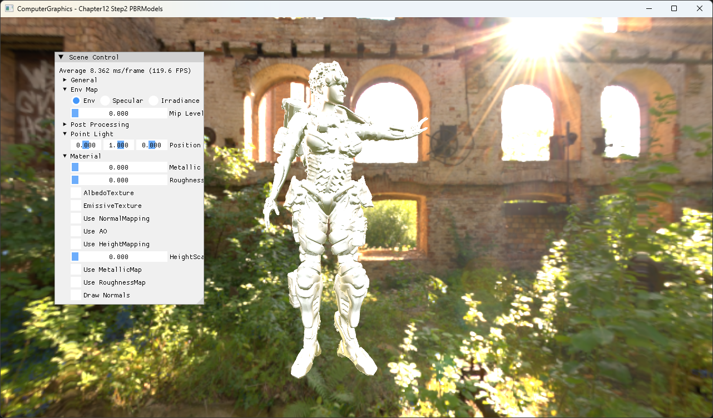
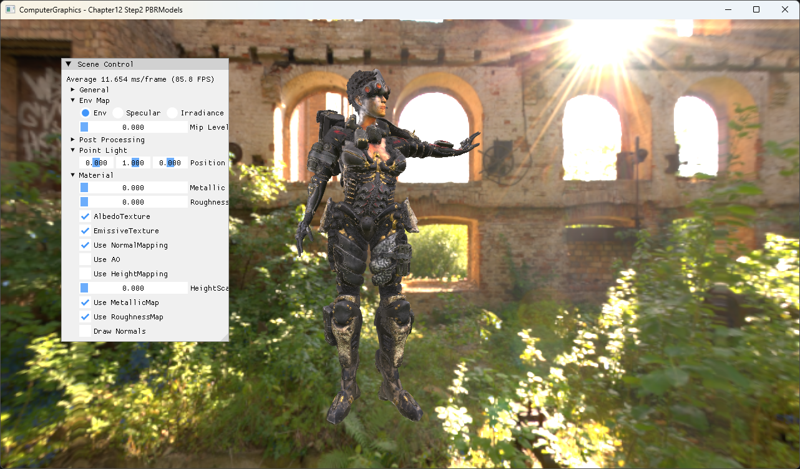

# Chapter12 Step2 PBRModels

Step1의 PBR pipeline을 Assimp로 불러온 multi-surface character model에 적용하는 예제다.

## 구현 요약

- FBX mesh를 읽고 vertex, index와 tangent 정보를 GPU buffer로 구성한다.
- Model material에 albedo, emissive, normal, metallic과 roughness map을 연결한다.
- Step1의 IBL·direct PBR 경로를 imported geometry에 재사용한다.
- Model load가 빈 mesh를 반환하면 초기화를 실패시켜 잘못된 접근을 막는다.

## Step1 대비 변화

Procedural sphere의 단일 material 검증에서 imported model과 texture binding 검증으로 확장한다. PBR 이론은 Step1과 Topic에 위임한다.

## 핵심 코드

- [FBX load와 material texture 연결](ExampleApp.cpp#L35-L67)
- [Assimp material texture 추출](ModelLoader.cpp#L134-L208)
- [Mesh별 texture resource 구성](BasicMeshGroup.cpp#L51-L106)
- [Emissive를 포함한 PBR shading](BasicPS.hlsl#L131-L181)

## Build And Run

| 항목 | 결과 | 비고 |
| --- | --- | --- |
| Debug x64 build/run | 성공 | Clean/Rebuild, Assimp·DirectXMesh runtime |
| Release x64 build/run | 성공 | Clean/Rebuild, project 폴더 CWD |
| Capture | 완료 | Model map 5종 On |

## Capture/Result

Rendered evidence는 공개 후보로 사용하고 원본 FBX·texture·HDRI는 직접 연결하지 않는다.

## 관련 문서

- [상세 Demo](../../Docs/03_Demos/Part3_Chapter10-13/12_02_PBRModels.md)
- [Model File Import](../../Docs/01_Topics/ModelingAndGeometry/ModelFileImport.md)
- [PBR Material Model](../../Docs/01_Topics/PBRAndIBL/PBRMaterialModel.md)
- [Verification](../../Docs/02_Verification/Part3_Chapter10-13/verification-index.md)
- [이전 단계](../12_PBR_Step1_UnrealPBR/README.md)
- 다음 Chapter: `13_LightAndShadow_Step1_Mirror`
