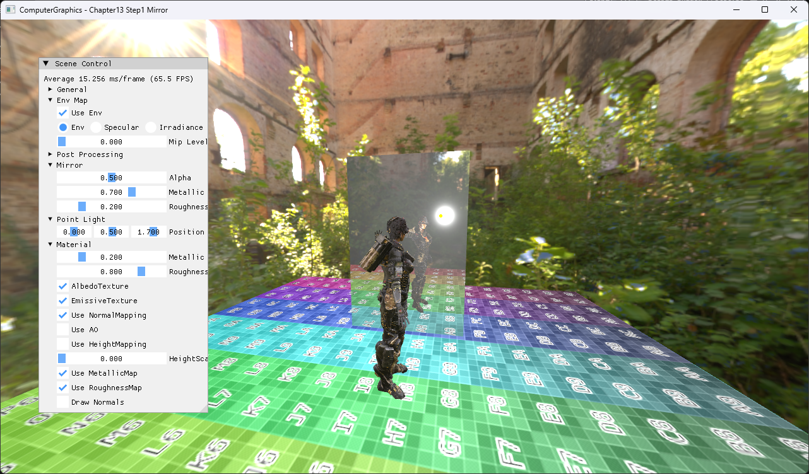

# Chapter13 Step1 Mirror

Stencil mask와 reflection matrix로 planar mirror를 그린다.

## 구현 요약

- Scene을 stencil에 제한해 반사 geometry를 별도 pass로 렌더링한다.
- Chapter13 공통 scene, HDR post-process와 UI 구조를 유지한다.
- 일반 이론은 Topic으로, build/run/capture 사실은 Verification으로 위임한다.

## 핵심 코드

- [Stencil mask와 reflection matrix 기반 planar mirror](./ExampleApp.cpp#L164-L181)

## Build And Run

| 항목 | 결과 | 비고 |
| --- | --- | --- |
| Debug x64 build/run | 성공 | Clean/Rebuild, project 폴더 CWD |
| Release x64 build/run | 성공 | Clean/Rebuild, project 폴더 CWD |
| Capture | 완료 | 전체 application window |

## Capture/Result

원본 runtime asset은 직접 연결하지 않고 rendered evidence만 사용한다.

## 관련 문서

- [상세 Demo](../../Docs/03_Demos/Part3_Chapter10-13/13_01_Mirror.md)
- [Topic](../../Docs/01_Topics/DirectX11Pipeline/StencilBufferAndMirrorRendering.md)
- [Verification](../../Docs/02_Verification/Part3_Chapter10-13/verification-index.md)
