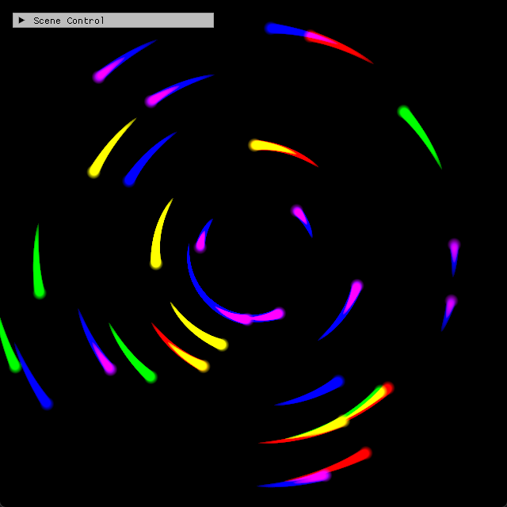

# Chapter14 Ex1407 IndirectArguments

## Overview

`Ex1407_IndirectArguments`는 density field particle update 뒤 GPU indirect argument buffer를 `DrawInstancedIndirect`에 직접 전달하는 예제다. `Examples.exe 1407`은 visual이 유사한 `Ex1406`과 달리 CPU draw count가 아닌 GPU buffer의 argument를 사용하는 흐름을 확인한다.

## 실행 진입점

- Solution: `Part4_Chapter14-20/Examples.sln`
- Application entry: `Examples.exe 1407`
- 주요 source: `Ex1407_IndirectArguments.cpp`
- Shader: `Ex1406_DensitySourcingCS.hlsl`, `Ex1406_DensityDissipationCS.hlsl`, `Ex1406_SpriteGS.hlsl`

## Code Map

| 파일 | 역할 |
| --- | --- |
| [main.cpp](../main.cpp#L56) | command argument `1407`을 `Ex1407_IndirectArguments` instance에 연결 |
| [Ex1407_IndirectArguments.cpp](../Ex1407_IndirectArguments.cpp#L56) | `IndirectArgs` 배열로 GPU argument buffer를 생성 |
| [Ex1407_IndirectArguments.cpp](../Ex1407_IndirectArguments.cpp#L112) | density dissipation과 particle sourcing compute pass를 수행 |
| [Ex1407_IndirectArguments.cpp](../Ex1407_IndirectArguments.cpp#L142) | argument buffer offset을 지정하고 `DrawInstancedIndirect`를 호출 |

## Capture/Result

640x640 density trail screenshot은 particle output을 보여 주는 보조 evidence다. indirect draw 여부는 `DrawInstancedIndirect(m_argsGPU.Get(), offset)` code evidence로 함께 확인한다.

## Verification

| 항목 | 결과 | 비고 |
| --- | --- | --- |
| Debug x64 build/run | 성공 | 2026-08-06 직접 확인 |
| Release x64 build/run | 과거 확인 | 현재 재검증은 별도 범위 |
| Capture/Result | tracked 후보 + code evidence | 640x640 trail과 GPU argument draw |

## Limitations

- screenshot만으로 indirect argument buffer 사용 여부를 구분할 수 없다.
- 현재 argument data는 CPU에서 초기화하며, GPU가 조건에 따라 argument를 갱신하는 culling workflow는 구현하지 않는다.

## Related Docs

- [Chapter14-20 README](../README.md)
- [Compute Shader And Resource Flow](../../Docs/01_Topics/ComputeAndSimulation/ComputeShaderAndResourceFlow.md)
- [Part4 Verification](../../Docs/02_Verification/Part4_Chapter14-20/verification-index.md)
- [Chapter14 Ex1407 IndirectArguments Demo](../../Docs/03_Demos/Part4_Chapter14-20/14_07_IndirectArguments.md)
- [Publication Candidate List](../../Docs/05_Publication/candidate-list.md)