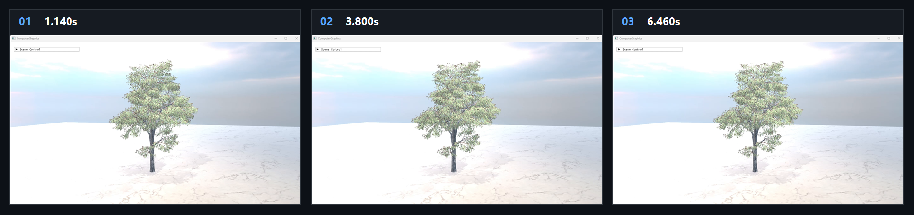

# Chapter18 Ex1801 Tree

## Overview

`Ex1801_Tree`는 imported foliage mesh를 trunk/branch와 leaves group으로 분리하고 vertex shader wind parameter로 procedural deformation을 적용하는 예제다. `Examples.exe 1801`은 runtime foliage, PBR texture와 HDRI asset을 사용하며 rendered storyboard만 evidence로 연결한다.

## 실행 진입점

- Solution: `Part4_Chapter14-20/Examples.sln`
- Application entry: `Examples.exe 1801`
- Working directory: `Part4_Chapter14-20` source root
- Runtime assets: foliage FBX, PBR texture와 HDRI files
- 주요 source: `Ex1801_Tree.cpp`
- Shader: `BasicVS.hlsl`

## Code Map

| 파일 | 역할 |
| --- | --- |
| [main.cpp](../main.cpp#L92) | command argument `1801`을 `Ex1801_Tree` instance에 연결 |
| [Ex1801_Tree.cpp](../Ex1801_Tree.cpp#L58) | imported foliage mesh를 leaves와 trunk/branch model group으로 분리 |
| [Ex1801_Tree.cpp](../Ex1801_Tree.cpp#L72) | trunk와 leaves의 material 및 wind parameter를 설정 |
| [Ex1801_Tree.cpp](../Ex1801_Tree.cpp#L111) | `WindTrunk`과 `WindLeaves` UI 값을 mesh constants에 반영 |
| [BasicVS.hlsl](../BasicVS.hlsl#L68) | trunk rotation과 leaf displacement wind vertex path를 수행 |

## Capture/Result

대표 storyboard는 trunk/branch와 leaves mesh group으로 구성한 tree scene을 보여 준다. original foliage asset과 timestamp provenance는 상세 Demo와 Verification에 둔다.

## Verification

| 항목 | 결과 | 비고 |
| --- | --- | --- |
| Debug x64 build/run | 성공 | 2026-08-07 smoke, Verification 정본 참조 |
| Release x64 build/run | 성공 | 2026-08-07 smoke, Verification 정본 참조 |
| Capture/Result | tracked storyboard | rendered evidence만 사용 |

## Limitations

- wind deformation은 procedural vertex transform이며 branch physics, leaf collision 또는 foliage simulation을 수행하지 않는다.
- `WindTrunk`은 leaves와 trunk에 함께 적용하고 `WindLeaves`는 leaves에만 적용한다.

## Related Docs

- [Foliage Terrain And Ocean Rendering](../../Docs/01_Topics/FoliageAndLandscape/FoliageTerrainAndOceanRendering.md)
- [Part4 Verification](../../Docs/02_Verification/Part4_Chapter14-20/verification-index.md)
- [Chapter18 Ex1801 Tree Demo](../../Docs/03_Demos/Part4_Chapter14-20/18_01_Tree.md)