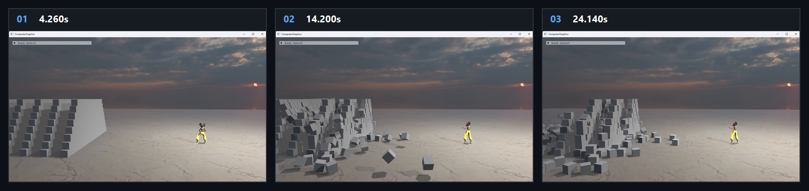

# Chapter20 Ex2001 GamePlay

## Overview

`Ex2001_GamePlay`는 character fire animation notify frame에서 PhysX projectile과 billboard fire effect를 생성하고, dynamic actor pose를 render transform으로 동기화하는 integration 예제다. `Examples.exe 2001`은 Mixamo animation, PhysX runtime DLL, PBR texture와 HDRI asset을 필요로 한다.

## 실행 진입점

- Solution: `Part4_Chapter14-20/Examples.sln`
- Application entry: `Examples.exe 2001`
- Working directory: `Part4_Chapter14-20` source root
- Runtime dependencies: Mixamo character/animation, PhysX DLL, PBR texture와 HDRI files
- 주요 source: `Ex2001_GamePlay.cpp`
- Shader: skinned mesh, volumetric fire billboard와 standard model render path

## Code Map

| 파일 | 역할 |
| --- | --- |
| [main.cpp](../main.cpp#L104) | command argument `2001`을 `Ex2001_GamePlay` instance에 연결 |
| [Ex2001_GamePlay.cpp](../Ex2001_GamePlay.cpp#L41) | character mesh와 fire animation clip을 구성 |
| [Ex2001_GamePlay.cpp](../Ex2001_GamePlay.cpp#L137) | PhysX gravity scene, ground plane과 dynamic block stack을 준비 |
| [Ex2001_GamePlay.cpp](../Ex2001_GamePlay.cpp#L171) | projectile actor와 fire billboard model을 함께 생성 |
| [Ex2001_GamePlay.cpp](../Ex2001_GamePlay.cpp#L239) | fire input edge, animation notify와 projectile spawn을 처리 |
| [Ex2001_GamePlay.cpp](../Ex2001_GamePlay.cpp#L284) | physics actor pose를 render scale/world transform으로 동기화 |

## Capture/Result

대표 storyboard는 fire animation, projectile actor와 block destruction이 한 frame update에 결합된 rendered evidence다. timestamp와 gameplay progression은 상세 Demo와 Verification에 둔다.

## Verification

| 항목 | 결과 | 비고 |
| --- | --- | --- |
| Debug x64 build/run | 성공 | 2026-08-07 smoke, Verification 정본 참조 |
| Release x64 build/run | 성공 | 2026-08-07 smoke, Verification 정본 참조 |
| Capture/Result | tracked storyboard | rendered evidence만 사용 |

## Limitations

- fire input은 `G` key와 cooldown으로 제한하며 general input mapping을 구현하지 않는다.
- animation sampling은 frame index 기반이며 impact event, damage system과 collision callback은 구현하지 않는다.

## Related Docs

- [Animation Physics And Gameplay Integration](../../Docs/01_Topics/AnimationAndPhysics/AnimationPhysicsAndGameplayIntegration.md)
- [Part4 Verification](../../Docs/02_Verification/Part4_Chapter14-20/verification-index.md)
- [Chapter20 Ex2001 GamePlay Demo](../../Docs/03_Demos/Part4_Chapter14-20/20_01_GamePlay.md)